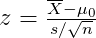
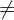
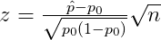
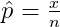
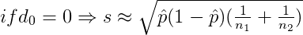
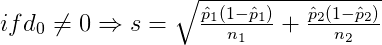
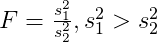
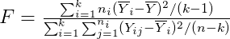

README
================

[](https://github.com/okgreece/gginference/actions)
[](https://cran.r-project.org/package=gginference)
[](http://www.repostatus.org/#active)
[](http://cran.rstudio.com/web/packages/gginference/index.html)
[](https://www.gnu.org/licenses/old-licenses/gpl-2.0.html)
[](https://doi.org/10.5281/zenodo.1745505)

# Overview

Visualise the results of F test to compare two variances, Student’s
t-test, test of equal or given proportions, Pearson’s chi-squared test
for count data and test for association/correlation between paired
samples.

# Installation

``` r
# CRAN installation:
install.packages("gginference")

# Or the development version from GitHub:
# install.packages("devtools")
devtools::install_github("okgreece/gginference")
```

# Usage

## One sample

### One sample t-test with normal population and σ<sup>2</sup> unknown

The rejection regions for one sample t-test with normal population and
σ<sup>2</sup> unknown are calculated using `ggttest` function. The
following table shows the rejection regions which is calculated with
**gginference** depending the specified parameters in `t.test`.

<table>
<colgroup>
<col style="width: 10%" />
<col style="width: 13%" />
<col style="width: 30%" />
<col style="width: 45%" />
</colgroup>
<thead>
<tr class="header">
<th><span class="math inline"><em>H</em><sub>0</sub></span></th>
<th><span class="math inline"><em>H</em><sub>1</sub></span></th>
<th>Rejection Region of <strong><em>gginference</em></strong></th>
<th>Parameters of <code>t.test</code></th>
</tr>
</thead>
<tbody>
<tr class="odd">
<td><span class="math inline"><em>μ</em> = <em>μ</em><sub>0</sub></span></td>
<td><span class="math inline"><em>μ</em> &lt; <em>μ</em><sub>0</sub></span></td>
<td><span class="math inline"><em>R</em> = {<em>z</em> &lt;  − <em>z</em><sub><em>a</em></sub>}</span></td>
<td><ul>
<li><em>x</em> = vector of sample data,</li>
<li><em>mu</em> = <span class="math inline"><em>μ</em><sub>0</sub></span>,</li>
<li><em>alternative</em> = “less”</li>
</ul></td>
</tr>
<tr class="even">
<td></td>
<td><span class="math inline"><em>μ</em> &gt; <em>μ</em><sub>0</sub></span></td>
<td><span class="math inline"><em>R</em> = {<em>z</em> &gt; <em>z</em><sub><em>a</em></sub>}</span></td>
<td><ul>
<li><em>x</em> = vector of sample data,</li>
<li><em>mu</em> = <span class="math inline"><em>μ</em><sub>0</sub></span>,</li>
<li><em>alternative</em> = “greater”</li>
</ul></td>
</tr>
<tr class="odd">
<td></td>
<td><span class="math inline"><em>μ</em> ≠ <em>μ</em><sub>0</sub></span></td>
<td><span class="math inline"><em>R</em> = {|<em>z</em>| &gt; <em>z</em><sub><em>a</em>/2</sub>}</span></td>
<td><ul>
<li><em>x</em> = vector of sample data,</li>
<li><em>mu</em> = <span class="math inline"><em>μ</em><sub>0</sub></span>,</li>
<li><em>alternative</em> = “two.sided”</li>
</ul></td>
</tr>
</tbody>
</table>

where



### One sample t-test with normal population and n \< 30 and σ<sup>2</sup> unknown

`ggttest` is also used to calculate rejection region for one sample
t-test with normal population and n \< 30 and σ<sup>2</sup> unknown.

<table>
<colgroup>
<col style="width: 10%" />
<col style="width: 13%" />
<col style="width: 30%" />
<col style="width: 45%" />
</colgroup>
<thead>
<tr class="header">
<th><span class="math inline"><em>H</em><sub>0</sub></span></th>
<th><span class="math inline"><em>H</em><sub>1</sub></span></th>
<th>Rejection Region of <strong><em>gginference</em></strong></th>
<th>Parameters of <code>t.test</code></th>
</tr>
</thead>
<tbody>
<tr class="odd">
<td><span class="math inline"><em>μ</em> = <em>μ</em><sub>0</sub></span></td>
<td><span class="math inline"><em>μ</em> &lt; <em>μ</em><sub>0</sub></span></td>
<td><span class="math inline"><em>R</em> = {<em>t</em> &lt;  − <em>t</em><sub><em>n</em> − 1, <em>a</em></sub>}</span></td>
<td><ul>
<li><em>x</em> = vector of sample data,</li>
<li><em>mu</em> = <span class="math inline"><em>μ</em><sub>0</sub></span>,</li>
<li><em>alternative</em> = “less”</li>
</ul></td>
</tr>
<tr class="even">
<td></td>
<td><span class="math inline"><em>μ</em> &gt; <em>μ</em><sub>0</sub></span></td>
<td><span class="math inline"><em>R</em> = {<em>t</em> &gt; <em>t</em><sub><em>n</em> − 1, <em>a</em></sub>}</span></td>
<td><ul>
<li><em>x</em> = vector of sample data,</li>
<li><em>mu</em> = <span class="math inline"><em>μ</em><sub>0</sub></span>,</li>
<li><em>alternative</em> = “greater”</li>
</ul></td>
</tr>
<tr class="odd">
<td></td>
<td><span class="math inline"><em>μ</em> ≠ <em>μ</em><sub>0</sub></span></td>
<td><span class="math inline"><em>R</em> = {|<em>t</em>| &gt; <em>t</em><sub><em>n</em> − 1, <em>a</em>/2</sub>}</span></td>
<td><ul>
<li><em>x</em> = vector of sample data,</li>
<li><em>mu</em> = <span class="math inline"><em>μ</em><sub>0</sub></span>,</li>
<li><em>alternative</em> = “two.sided”</li>
</ul></td>
</tr>
</tbody>
</table>

where


## Two samples

### Two independent samples t-test with normal populations and σ<sub>1</sub><sup>2</sup> = σ<sub>2</sub><sup>2</sup> unknown

Next table shows the rejection regions of two independent samples t-test
with normal populations and σ<sub>1</sub><sup>2</sup> =
σ<sub>2</sub><sup>2</sup>. `ggttest` is also used to visualize this
test.

<table>
<colgroup>
<col style="width: 15%" />
<col style="width: 17%" />
<col style="width: 26%" />
<col style="width: 40%" />
</colgroup>
<thead>
<tr class="header">
<th><span class="math inline"><em>H</em><sub>0</sub></span></th>
<th><span class="math inline"><em>H</em><sub>1</sub></span></th>
<th>Rejection Region of <strong><em>gginference</em></strong></th>
<th>Parameters of <code>t.test</code></th>
</tr>
</thead>
<tbody>
<tr class="odd">
<td><span class="math inline"><em>μ</em><sub>1</sub> − <em>μ</em><sub>2</sub> = <em>d</em><sub>0</sub></span></td>
<td><span class="math inline"><em>μ</em><sub>1</sub> − <em>μ</em><sub>2</sub> &lt; <em>d</em><sub>0</sub></span></td>
<td><span class="math inline"><em>R</em> = {<em>t</em> &lt;  − <em>t</em><sub><em>n</em><sub>1</sub> + <em>n</em><sub>2</sub> − 2, <em>a</em></sub>}</span></td>
<td><ul>
<li><em>x</em> = vector of sample 1 data,</li>
<li><em>y</em> = vector of sample 2 data,</li>
<li><em>paired</em> = FALSE,</li>
<li><em>var.equal</em> = TRUE,</li>
<li><em>alternative</em> = “less”</li>
</ul></td>
</tr>
<tr class="even">
<td></td>
<td><span class="math inline"><em>μ</em><sub>1</sub> − <em>μ</em><sub>2</sub> &gt; <em>d</em><sub>0</sub></span></td>
<td><span class="math inline"><em>R</em> = {<em>t</em> &gt; <em>t</em><sub><em>n</em><sub>1</sub> + <em>n</em><sub>2</sub> − 2, <em>a</em></sub>}</span></td>
<td><ul>
<li><em>x</em> = vector of sample 1 data,</li>
<li><em>y</em> = vector of sample 2 data,</li>
<li><em>paired</em> = FALSE,</li>
<li><em>var.equal</em> = TRUE,</li>
<li><em>alternative</em> = “greater”</li>
</ul></td>
</tr>
<tr class="odd">
<td></td>
<td><span class="math inline"><em>μ</em><sub>1</sub> − <em>μ</em><sub>2</sub> ≠ <em>d</em><sub>0</sub></span></td>
<td><span class="math inline"><em>R</em> = {|<em>t</em>| &gt; <em>t</em><sub><em>n</em><sub>1</sub> + <em>n</em><sub>2</sub> − 2, <em>a</em>/2</sub>}</span></td>
<td><ul>
<li><em>x</em> = vector of sample 1 data,</li>
<li><em>y</em> = vector of sample 2 data,</li>
<li><em>paired</em> = FALSE,</li>
<li><em>var.equal</em> = TRUE,</li>
<li><em>alternative</em> = “two.sided”</li>
</ul></td>
</tr>
</tbody>
</table>

where


### Two independent samples t-test with normal populations and σ<sub>1</sub><sup>2</sup>  σ<sub>2</sub><sup>2</sup>

`ggttest` is used to visualize two independent samples t-test with
normal populations and σ<sub>1</sub><sup>2</sup>
 σ<sub>2</sub><sup>2</sup>. The following
table shows the rejection regions of this test.

<table>
<colgroup>
<col style="width: 15%" />
<col style="width: 17%" />
<col style="width: 26%" />
<col style="width: 40%" />
</colgroup>
<thead>
<tr class="header">
<th><span class="math inline"><em>H</em><sub>0</sub></span></th>
<th><span class="math inline"><em>H</em><sub>1</sub></span></th>
<th>Rejection Region of <strong><em>gginference</em></strong></th>
<th>Parameters of <code>t.test</code></th>
</tr>
</thead>
<tbody>
<tr class="odd">
<td><span class="math inline"><em>μ</em><sub>1</sub> − <em>μ</em><sub>2</sub> = <em>d</em><sub>0</sub></span></td>
<td><span class="math inline"><em>μ</em><sub>1</sub> − <em>μ</em><sub>2</sub> &lt; <em>d</em><sub>0</sub></span></td>
<td><span class="math inline"><em>R</em> = {<em>t</em> &lt;  − <em>t</em><sub><em>ν</em>, <em>a</em></sub>}</span></td>
<td><ul>
<li><em>x</em> = vector of sample 1 data,</li>
<li><em>y</em> = vector of sample 2 data,</li>
<li><em>paired</em> = FALSE,</li>
<li><em>var.equal</em> = FALSE,</li>
<li><em>alternative</em> = “less”</li>
</ul></td>
</tr>
<tr class="even">
<td></td>
<td><span class="math inline"><em>μ</em><sub>1</sub> − <em>μ</em><sub>2</sub> &gt; <em>d</em><sub>0</sub></span></td>
<td><span class="math inline"><em>R</em> = {<em>t</em> &gt; <em>t</em><sub><em>ν</em>, <em>a</em></sub>}</span></td>
<td><ul>
<li><em>x</em> = vector of sample 1 data,</li>
<li><em>y</em> = vector of sample 2 data,</li>
<li><em>paired</em> = FALSE,</li>
<li><em>var.equal</em> = FALSE,</li>
<li><em>alternative</em> = “greater”</li>
</ul></td>
</tr>
<tr class="odd">
<td></td>
<td><span class="math inline"><em>μ</em><sub>1</sub> − <em>μ</em><sub>2</sub> ≠ <em>d</em><sub>0</sub></span></td>
<td><span class="math inline"><em>R</em> = {|<em>t</em>| &gt; <em>t</em><sub><em>ν</em>, <em>a</em>/2</sub>}</span></td>
<td><ul>
<li><em>x</em> = vector of sample 1 data,</li>
<li><em>y</em> = vector of sample 2 data,</li>
<li><em>paired</em> = FALSE,</li>
<li><em>var.equal</em> = FALSE,</li>
<li><em>alternative</em> = “two.sided”</li>
</ul></td>
</tr>
</tbody>
</table>

where


and ν degrees of freedom with


## Paired samples with normal population

`ggttest` is used also to visualize the results of the paired sample
Student’s t-test. Next table shows th rejection region of this test.

<table>
<colgroup>
<col style="width: 14%" />
<col style="width: 17%" />
<col style="width: 27%" />
<col style="width: 40%" />
</colgroup>
<thead>
<tr class="header">
<th><span class="math inline"><em>H</em><sub>0</sub></span></th>
<th><span class="math inline"><em>H</em><sub>1</sub></span></th>
<th>Rejection Region of <strong><em>gginference</em></strong></th>
<th>Parameters of <code>t.test</code></th>
</tr>
</thead>
<tbody>
<tr class="odd">
<td><span class="math inline"><em>μ</em><sub>1</sub> − <em>μ</em><sub>2</sub> = <em>d</em><sub>0</sub></span></td>
<td><span class="math inline"><em>μ</em><sub>1</sub> − <em>μ</em><sub>2</sub> &lt; <em>d</em><sub>0</sub></span></td>
<td><span class="math inline"><em>R</em> = {<em>t</em> &lt;  − <em>t</em><sub><em>n</em> − 1, <em>a</em></sub>}</span></td>
<td><ul>
<li><em>x</em> = vector of sample 1 data,</li>
<li><em>y</em> = vector of sample 2 data,</li>
<li><em>paired</em> = FALSE,</li>
<li><em>var.equal</em> = FALSE,</li>
<li><em>alternative</em> = “less”</li>
</ul></td>
</tr>
<tr class="even">
<td></td>
<td><span class="math inline"><em>μ</em><sub>1</sub> − <em>μ</em><sub>2</sub> &gt; <em>d</em><sub>0</sub></span></td>
<td><span class="math inline"><em>R</em> = {<em>t</em> &gt; <em>t</em><sub><em>n</em> − 1, <em>a</em></sub>}</span></td>
<td><ul>
<li><em>x</em> = vector of sample 1 data,</li>
<li><em>y</em> = vector of sample 2 data,</li>
<li><em>paired</em> = FALSE,</li>
<li><em>var.equal</em> = FALSE,</li>
<li><em>alternative</em> = “greater”</li>
</ul></td>
</tr>
<tr class="odd">
<td></td>
<td><span class="math inline"><em>μ</em><sub>1</sub> − <em>μ</em><sub>2</sub> ≠ <em>d</em><sub>0</sub></span></td>
<td><span class="math inline"><em>R</em> = {|<em>t</em>| &gt; <em>t</em><sub><em>n</em> − 1, <em>a</em>/2</sub>}</span></td>
<td><ul>
<li><em>x</em> = vector of sample 1 data,</li>
<li><em>y</em> = vector of sample 2 data,</li>
<li><em>paired</em> = FALSE,</li>
<li><em>var.equal</em> = FALSE,</li>
<li><em>alternative</em> = “two.sided”</li>
</ul></td>
</tr>
</tbody>
</table>

where


## Proportion test

### One-proportion z-test

`ggproptest()` is used to visualize one-proportion z-test. The rejection
regions are shown below.

<table>
<colgroup>
<col style="width: 10%" />
<col style="width: 13%" />
<col style="width: 30%" />
<col style="width: 45%" />
</colgroup>
<thead>
<tr class="header">
<th><span class="math inline"><em>H</em><sub>0</sub></span></th>
<th><span class="math inline"><em>H</em><sub>1</sub></span></th>
<th>Rejection Region of <strong><em>gginference</em></strong></th>
<th>Parameters of <code>prop.test()</code></th>
</tr>
</thead>
<tbody>
<tr class="odd">
<td><span class="math inline"><em>p</em> = <em>p</em><sub>0</sub></span></td>
<td><span class="math inline"><em>p</em> &lt; <em>p</em><sub>0</sub></span></td>
<td><span class="math inline"><em>R</em> = {<em>z</em> &lt;  − <em>z</em><sub><em>a</em></sub>}</span></td>
<td><ul>
<li><em>x</em> = vector of sample data,</li>
<li><em>mu</em> = <span class="math inline"><em>μ</em><sub>0</sub></span>,</li>
<li><em>alternative</em> = “less”</li>
</ul></td>
</tr>
<tr class="even">
<td></td>
<td><span class="math inline"><em>p</em> &gt; <em>p</em><sub>0</sub></span></td>
<td><span class="math inline"><em>R</em> = {<em>z</em> &gt; <em>z</em><sub><em>a</em></sub>}</span></td>
<td><ul>
<li><em>x</em> = vector of sample data,</li>
<li><em>mu</em> = <span class="math inline"><em>μ</em><sub>0</sub></span>,</li>
<li><em>alternative</em> = “greater”</li>
</ul></td>
</tr>
<tr class="odd">
<td></td>
<td><span class="math inline"><em>p</em> ≠ <em>p</em><sub>0</sub></span></td>
<td><span class="math inline"><em>R</em> = {|<em>z</em>| &gt; <em>z</em><sub><em>a</em>/2</sub>}</span></td>
<td><ul>
<li><em>x</em> = vector of sample data,</li>
<li><em>mu</em> = <span class="math inline"><em>μ</em><sub>0</sub></span>,</li>
<li><em>alternative</em> = “two.sided”</li>
</ul></td>
</tr>
</tbody>
</table>

where





### Two-proportion z-test

The results of two-proportion z-test are visualized using `ggproptest()`
and next table shows the rejection regions.

<table>
<colgroup>
<col style="width: 14%" />
<col style="width: 17%" />
<col style="width: 27%" />
<col style="width: 41%" />
</colgroup>
<thead>
<tr class="header">
<th><span class="math inline"><em>H</em><sub>0</sub></span></th>
<th><span class="math inline"><em>H</em><sub>1</sub></span></th>
<th>Rejection Region of <strong><em>gginference</em></strong></th>
<th>Parameters of <code>prop.test()</code></th>
</tr>
</thead>
<tbody>
<tr class="odd">
<td><span class="math inline"><em>p</em><sub>1</sub> − <em>p</em><sub>2</sub> = <em>d</em><sub>0</sub></span></td>
<td><span class="math inline"><em>p</em><sub>1</sub> − <em>p</em><sub>2</sub> &lt; <em>d</em><sub>0</sub></span></td>
<td><span class="math inline"><em>R</em> = {<em>z</em> &lt;  − <em>z</em><sub><em>a</em></sub>}</span></td>
<td><ul>
<li><em>x</em> = vector of sample 1 data,</li>
<li><em>y</em> = vector of sample 2 data,</li>
<li><em>paired</em> = FALSE,</li>
<li><em>var.equal</em> = FALSE,</li>
<li><em>alternative</em> = “less”</li>
</ul></td>
</tr>
<tr class="even">
<td></td>
<td><span class="math inline"><em>p</em><sub>1</sub> − <em>p</em><sub>2</sub> &gt; <em>d</em><sub>0</sub></span></td>
<td><span class="math inline"><em>R</em> = {<em>z</em> &gt; <em>z</em><sub><em>a</em></sub>}</span></td>
<td><ul>
<li><em>x</em> = vector of sample 1 data,</li>
<li><em>y</em> = vector of sample 2 data,</li>
<li><em>paired</em> = FALSE,</li>
<li><em>var.equal</em> = FALSE,</li>
<li><em>alternative</em> = “greater”</li>
</ul></td>
</tr>
<tr class="odd">
<td></td>
<td><span class="math inline"><em>p</em><sub>1</sub> − <em>p</em><sub>2</sub> ≠ <em>d</em><sub>0</sub></span></td>
<td><span class="math inline"><em>R</em> = {|<em>z</em>| &gt; <em>z</em><sub><em>a</em>/2</sub>}</span></td>
<td><ul>
<li><em>x</em> = vector of sample 1 data,</li>
<li><em>y</em> = vector of sample 2 data,</li>
<li><em>paired</em> = FALSE,</li>
<li><em>var.equal</em> = FALSE,</li>
<li><em>alternative</em> = “two.sided”</li>
</ul></td>
</tr>
</tbody>
</table>

where







## Two-sample F test for equality of variances

`ggvartest` is used to visualize the results of the paired sample
Student’s t-test. The rejection region that is used in this test is
shown below.

<table>
<colgroup>
<col style="width: 21%" />
<col style="width: 23%" />
<col style="width: 22%" />
<col style="width: 32%" />
</colgroup>
<thead>
<tr class="header">
<th><span class="math inline"><em>H</em><sub>0</sub></span></th>
<th><span class="math inline"><em>H</em><sub>1</sub></span></th>
<th>Rejection Region of <strong><em>gginference</em></strong></th>
<th>Parameters of <code>var.test</code></th>
</tr>
</thead>
<tbody>
<tr class="odd">
<td>σ<sub>1</sub><sup>2</sup> / σ<sub>2</sub><sup>2</sup> = 1</td>
<td>σ<sub>1</sub><sup>2</sup> / σ<sub>2</sub><sup>2</sup> &lt; 1</td>
<td><span class="math inline"><em>R</em> = {<em>F</em> &gt; <em>F</em><sub><em>n</em><sub>1</sub> − 1, <em>n</em><sub>2</sub> − 1, 1 − <em>a</em></sub>}</span></td>
<td><ul>
<li><em>x</em> = vector of sample 1 data,</li>
<li><em>y</em> = vector of sample 2 data,</li>
<li><em>ratio</em> = 1</li>
<li><em>alternative</em> = “less”</li>
</ul></td>
</tr>
<tr class="even">
<td></td>
<td>σ<sub>1</sub><sup>2</sup> / σ<sub>2</sub><sup>2</sup> &gt; 1</td>
<td><span class="math inline"><em>R</em> = {<em>F</em> &gt; <em>F</em><sub><em>n</em><sub>1</sub> − 1, <em>n</em><sub>2</sub> − 1, <em>a</em></sub>}</span></td>
<td><ul>
<li><em>x</em> = vector of sample data,</li>
<li><em>mu</em> = <span class="math inline"><em>μ</em><sub>0</sub></span>,</li>
<li><em>ratio</em> = 1</li>
<li><em>alternative</em> = “greater”</li>
</ul></td>
</tr>
<tr class="odd">
<td></td>
<td>σ<sub>1</sub><sup>2</sup> / σ<sub>2</sub><sup>2</sup> <span class="math inline">≠</span> 1</td>
<td><span class="math inline"><em>R</em> = {<em>F</em> &gt; <em>F</em><sub><em>n</em><sub>1</sub> − 1, <em>n</em><sub>2</sub> − 1, <em>a</em>/2</sub>}</span></td>
<td><ul>
<li><em>x</em> = vector of sample data,</li>
<li><em>mu</em> = <span class="math inline"><em>μ</em><sub>0</sub></span>,</li>
<li><em>ratio</em> = 1</li>
<li><em>alternative</em> = “two.sided”</li>
</ul></td>
</tr>
</tbody>
</table>

where



## Test for Correlation Between Paired Samples

`ggcortest` is usesd to visualize the results of test for correlation
between paired samples. The following table shows the rejection region
of this test.

<table>
<colgroup>
<col style="width: 15%" />
<col style="width: 24%" />
<col style="width: 23%" />
<col style="width: 35%" />
</colgroup>
<thead>
<tr class="header">
<th><span class="math inline"><em>H</em><sub>0</sub></span></th>
<th><span class="math inline"><em>H</em><sub>1</sub></span></th>
<th>Rejection Region of <strong><em>gginference</em></strong></th>
<th>Parameters of <code>cor.test</code></th>
</tr>
</thead>
<tbody>
<tr class="odd">
<td><span class="math inline">𝜚 = 0</span></td>
<td><span class="math inline">𝜚 ≠ 0</span></td>
<td><span class="math inline"><em>R</em> = {|<em>t</em>| &gt; <em>t</em><sub><em>n</em> − 2, <em>a</em>/2</sub>}</span></td>
<td><ul>
<li><em>x</em> = vector of sample 1 data</li>
<li><em>y</em> = vector of sample 2 data,</li>
<li><em>alternative</em> = “two.sided”</li>
</ul></td>
</tr>
</tbody>
</table>

where


## Chi-squared Test of Independence

The results of Pearson’s chi-squared test for count data are visulized
using `ggchisqtest`. Next table shows the rejection region of this test.

<table>
<colgroup>
<col style="width: 20%" />
<col style="width: 26%" />
<col style="width: 25%" />
<col style="width: 27%" />
</colgroup>
<thead>
<tr class="header">
<th><span class="math inline"><em>H</em><sub>0</sub></span></th>
<th><span class="math inline"><em>H</em><sub>1</sub></span></th>
<th>Rejection Region of <strong><em>gginference</em></strong></th>
<th>Parameters of <code>chisq.test</code></th>
</tr>
</thead>
<tbody>
<tr class="odd">
<td>Two variables are independent</td>
<td>Two variables are not independent</td>
<td><span class="math inline"><em>R</em> = {<em>X</em><sup>2</sup> &gt; <em>χ</em><sub><em>a</em>/2</sub><sup>2</sup>}</span></td>
<td><ul>
<li><em>x</em> = 2-dimensional contingency table</li>
</ul></td>
</tr>
</tbody>
</table>

where


## ANOVA F-test

`ggaov` is used to visualize the results of ANOVA F-test. Table below
shows rejection region of Anova F-stest.

<table>
<colgroup>
<col style="width: 16%" />
<col style="width: 17%" />
<col style="width: 24%" />
<col style="width: 42%" />
</colgroup>
<thead>
<tr class="header">
<th><span class="math inline"><em>H</em><sub>0</sub></span></th>
<th><span class="math inline"><em>H</em><sub>1</sub></span></th>
<th>Rejection Region of <strong><em>gginference</em></strong></th>
<th>Parameters of <code>aov</code></th>
</tr>
</thead>
<tbody>
<tr class="odd">
<td><span class="math inline"><em>H</em><sub>0</sub> : <em>μ</em><sub>1</sub> = <em>μ</em><sub>2</sub>=</span> <span class="math inline">... = <em>μ</em><sub><em>k</em></sub></span></td>
<td>Not all three population means are equal</td>
<td><span class="math inline"><em>R</em> = {<em>F</em> &gt; <em>F</em><sub><em>k</em></sub> − 1, <em>n</em> − <em>k</em>, <em>a</em>}</span></td>
<td><ul>
<li><em>formula</em> = formula specifying the model</li>
<li><em>data</em> = data frame with the variables specified in the formula</li>
</ul></td>
</tr>
</tbody>
</table>

where



# Getting help

If you encounter a bug, please feel free to open an
[issue](https://github.com/okgreece/gginference/issues) with a minimal
reproducible example.
